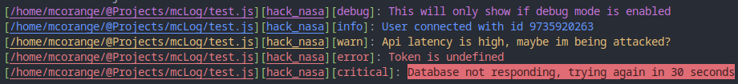

# mcLog

A library for logging that will suite all of your needs.



Its highly configurable, with 16 configurable options (as of the time writing this)

## Usage

Usage is simple, even a 5 year old could use it, if they can type and read.

```js
logger.info("Info message", "file path or for easier use __filename", "position, like function or the row:col position in the file")
```

```js
const Logger = require("@mcorange9/mclog")
const logger = new Logger(
                        debug_mode=false
                    )

logger.debug("This will only show if debug mode is enabled", __filename, "hack_nasa")

logger.info(logger.format("User connected with id {}", user.id), __filename, "on_connect")

logger.warn(logger.format("Api latency is higher than expected ({}), maybe im being attacked?"), ping, __filename, "api_ping_tester")

if (!token instanceof String){
    logger.error(logger.format("Expected token type String, but found {}", typeof token), __filename, "init")
}

logger.critical("Database not responding, trying again in 30 seconds", __filename, "database.connect")

```

## Config

All config options have to be passed in the constructor:

```js
const Logger = require("@mcorange9/mclog")
const logger = new Logger(
                        debug_mode=                  false,
                        enable_file_logging=         true,
                        enable_colored_logging=      true,
                        full_log_file_path=          "./logs/{DATE-LESS}-full.log",
                        info_log_file_path=          "./logs/{DATE-LESS}-info.log",
                        debug_log_file_path=         "./logs/{DATE-LESS}-debug.log",

                        // Used for logging to file if file logging is enable
                        // Also used for console logging if colors are not enabled
                        debug_text=                  "[{FILE}][{POS}][debug]: {TEXT}",
                        info_text=                   "[{FILE}][{POS}][info]: {TEXT}",
                        warn_text=                   "[{FILE}][{POS}][warn]: {TEXT}",
                        error_text=                  "[{FILE}][{POS}][error]: {TEXT}",
                        critical_text=               "[{FILE}][{POS}][critical]: {TEXT}",
                        
                        // Used for logging to console if colors are enabled
                        debug_text_color=            "&2[&5&u{FILE}&r&2][&5&u{POS}&r&2][&5debug&2]&r:&5 {TEXT}&r",
                        info_text_color=             "&2[&4&u{FILE}&r&2][&4&u{POS}&r&2][&4info&2]&r:&4 {TEXT}&r",
                        warn_text_color=             "&2[&6&u{FILE}&r&2][&6&u{POS}&r&2][&6warn&2]&r:&6 {TEXT}&r",
                        error_text_color=            "&2[&1&u{FILE}&r&2][&1&u{POS}&r&2][&1error&2]&r:&1 {TEXT}&r",
                        critical_text_color=         "&2[&1&u{FILE}&r&2][&1&u{POS}&r&2][&1critical&2]&r: &b1{TEXT}&r",
                    )
```

As you can see you can desight the log text __yourself__.

Those weird `&2` things are color codes.

`fg` => Bext color
`bg` => Background color

|  Color code   |   Color             |
|---------------|---------------------|
|      &r       |     Reset           |
|      &br      |     Bright          |
|      &dm      |     Dim text        |
|      &u       |     Underlined      |
|      &bl      |     Blink           |
|      &rv      |     Reversed        |
|      &hd      |     Hidden          |
|      &0       |     FgBlack         |
|      &1       |     FgRed           |
|      &2       |     FgGreen         |
|      &3       |     FgCyan          |
|      &4       |     FgBlue          |
|      &5       |     FgMagenta       |
|      &6       |     FgYellow        |
|      &7       |     FgWhite         |
|      &b0      |     BgBlack         |
|      &b1      |     BgRed           |
|      &b2      |     BgGreen         |
|      &b3      |     BgCyan          |
|      &b4      |     BgRed           |
|      &b5      |     BgMagenta       |
|      &b6      |     BgYellow        |
|      &b7      |     BgWhite         |

## Author

[MCorange](https://github.com/MCorange99)